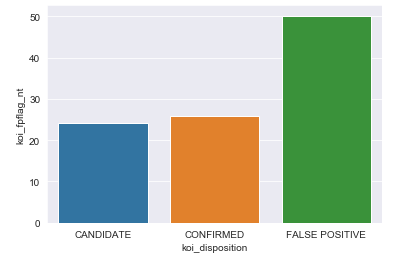

# Machine Learning Homework - Exoplanet Exploration


## Background

Over a period of nine years in deep space, the NASA Kepler space telescope has been out on a planet-hunting mission to discover hidden planets outside of our solar system.

To help process this data, different machine learning models are created that are capable of classifying candidate exoplanets from the raw dataset.

[Exoplanet Data Source](https://www.kaggle.com/nasa/kepler-exoplanet-search-results)

Description of Exoplanet features can be found [here](https://exoplanetarchive.ipac.caltech.edu/docs/API_kepcandidate_columns.html)

Following tasks are performed.

1. [Preprocess the raw data](#Preprocessing)
2. [Tune the models](#Tune-Model-Parameters)
3. [Compare two or more models](#Evaluate-Model-Performance)

- - -

### Preprocess the Data

* Check for NaN values and process them. 
* Performed Exploratory Data Analysis.
* Performed feature selection and removed unnecessary features.
* Performed label Encoding to convert Target label into numeric values.
* Used `MinMaxScaler` to scale the numerical data.
* Separated the data into training and testing data.

### Tune Model Parameters

* Used `GridSearch` to tune model parameters.
* Tuned and compared following models.
   1) [Logistic Regression model](logistic_regression_model.ipynb)
   2) [Decision Tree and Random Forest model](random_forrest_model.ipynb)
   3) [Support Vector Machine model](SVM_model.ipynb)
   4) [Deep Learning Model](deep_learning_model.ipynb)

### Reporting

Dataset had many features representing error for different features and all those columns were removed.

X Features

```
['koi_fpflag_nt', 'koi_fpflag_ss', 'koi_fpflag_co',
       'koi_fpflag_ec', 'koi_period', 'koi_time0bk', 'koi_impact',
       'koi_duration', 'koi_depth', 'koi_prad', 'koi_teq', 'koi_insol',
       'koi_model_snr', 'koi_tce_plnt_num', 'koi_steff', 'koi_slogg',
       'koi_srad', 'ra', 'dec', 'koi_kepmag']
```

Y Label

```
koi_disposition

```
**3 classes for koi_disposition**

**CANDIDATE** - A candidate exoplanet is a likely planet discovered by the different instruments, but the information must yet to be verified.

**CONFIRMED** - An exoplanet or extrasolar planet is a planet outside the Solar System. As of 12 September 2019, there are 4,055 confirmed exoplanets. The majority of these planets were discovered by the Kepler space telescope.

**FALSE POSITIVE** -While it has been estimated that 90% of the KOI transit candidates are true planets,[5] it is expected that some of the KOIs will be false positives, i.e., not actual transiting planets. The majority of these false positives are anticipated to be eclipsing binaries which, while spatially much more distant and thus dimmer than the foreground KOI, are too close to the KOI on the sky for the Kepler telescope to differentiate. On the other hand, statistical fluctuations in the data are expected to contribute less than one false positive event in the entire set of 150,000 stars being observed by Kepler.[2] [Courtsey Wikipedia](https://en.wikipedia.org/wiki/Kepler_object_of_interest)

* Train and Test Data Split:

 Data was split with 70:30 ratio for train and test data for all models.

* Logistic Regression Model:

This model gave an f-score of 0.81 for test data. After hypertuning of parameters, score remained at 0.81 only.

* Support Vector Machine Model:

This model gave a f-score of 0.75 on test data and after hyperparameter tuning, score improved to 0.78.

* Deep Learning Model

In this model, tried with both and 1 and 2 hidden layers and best score was obtained with 1 hidden layer.
Loss: 0.35, Accuracy: 0.86

* Decision Tree and random Forest Model

This model provided the best score and accuracy of all the models with a value of **0.92**. An accuracy of .92 means, 91% or 91 correct predictions of exoplanets out of 100 predictions which is reasonably good accuracy. 

Original data was not equally represented with 50% 'False Positives' , 25% 'CONFIRMED' and 24% 'CANDIDATE'. 



SMOTE was done to make it balanced. 

**COnfusion Matrix**

```

[[762 106   8]
 [ 84 787   5]
 [  1   0 875]]

```

**Classification Report**

```
               precision    recall  f1-score   support

     CANDIDATE       0.90      0.87      0.88       876
     CONFIRMED       0.88      0.90      0.89       876
FALSE POSITIVE       0.99      1.00      0.99       876

      accuracy                           0.92      2628
     macro avg       0.92      0.92      0.92      2628
  weighted avg       0.92      0.92      0.92      2628

```

From the Classification report, an accuracy of 0.99 is seen for 'FALSE POSITIVES', 0.88 for 'CANDIDATE' and 0.89 for 'CONFIRMED' while predicting exoplanet objects.

Given more time, more feature engineering could be performed that might hopefully improve the accuracy.

Try models with different types of parameters.

Also, train and test ratio could be changed to see if any improvement in accuracy could be seen.


##### © 2019 Trilogy Education Services, a 2U, Inc. brand. All Rights Reserved.
